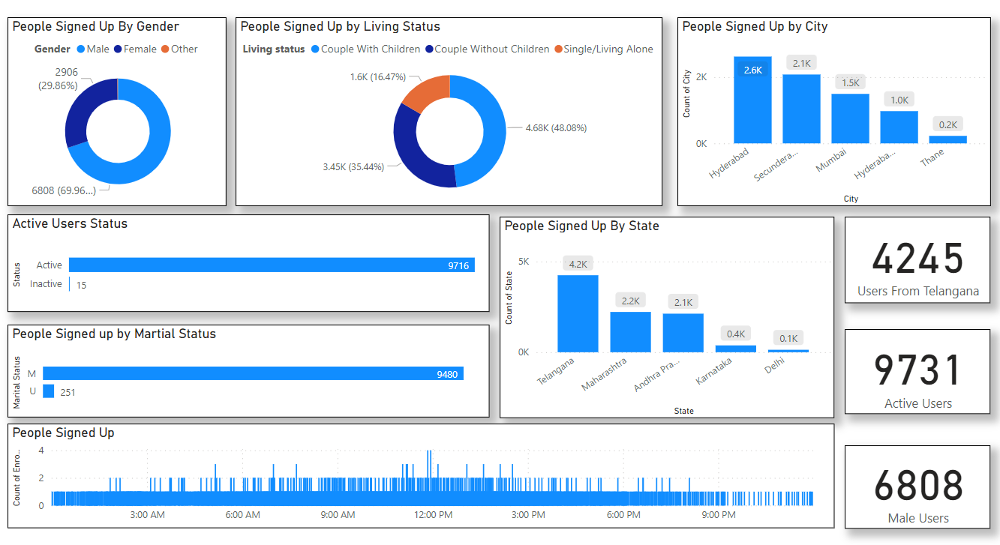

# Introduction
This is going to be readme file. This is the Project

This Dataset is taken from the list of Subscribers that are registered for Email Newsletters. 

This kind of dataset can be used for analysis. The goal can be the Email Marketing Purposes. 
- Also this is Email Marketing Dashboard
- we Have like 10,000+ Of emails that are inlisted

# Agenda for Analysis
The agenda for analytics is to find out the " Target Customer Base" that are most likely to sign up for our Email Newsletters.

# My Key Learning 
- One of my Key learning is to keep all state names, city names etc with same consistency 
- Like United Kingdom and UNITED KINGDOM might be two different attributes in Dataset but they can be converted into one by Keeping the consistency.
